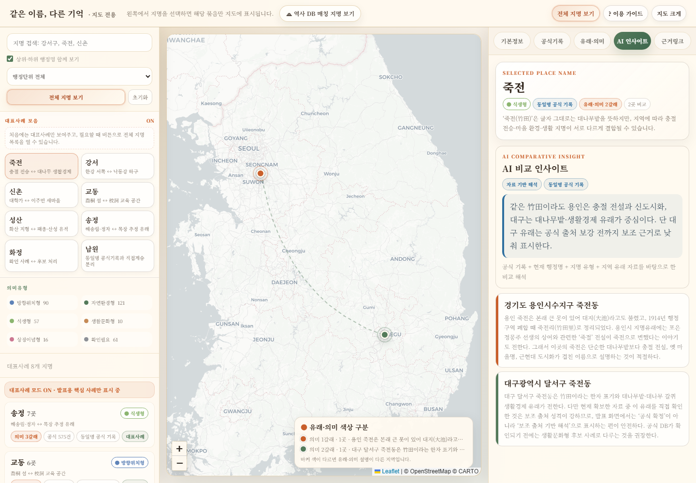

# 같은 이름, 다른 기억

AI로 분석한 한국 중복 지명의 공간 맵핑 프로젝트입니다. 같은 이름을 가진 한국의 행정 지명이 실제로는 서로 다른 지역 기억, 생활권, 역사적 맥락을 품고 있다는 점을 지도와 발표 자료로 보여줍니다.



## 배포 주소

- 메인: https://same-name-memory-deploy.vercel.app/
- 발표 화면: https://same-name-memory-deploy.vercel.app/presentation.html
- 지도 화면: https://same-name-memory-deploy.vercel.app/map.html

## 프로젝트 개요

이 프로젝트는 한국 곳곳에 반복되는 지명을 단순히 같은 이름으로 묶지 않고, 각 지역이 가진 다른 기억을 비교하기 위해 제작했습니다. 예를 들어 같은 `중앙`, `송정`, `죽전`, `신촌`이라는 이름이라도 어떤 곳은 행정 중심의 기억을, 어떤 곳은 식생, 생활문화, 해안, 산업, 주거 확장의 기억을 담고 있습니다.

최종 결과물은 두 화면으로 나누어 정리했습니다.

- `presentation.html`: 공모전 발표에 사용한 앞부분 이미지 슬라이드 중심 발표 화면
- `map.html`: 중복 지명을 선택하고 지도에서 위치와 해석을 비교하는 인터랙티브 지도 화면

## 데이터 수집 및 처리 방식

지도 데이터는 정적 HTML 안에 포함된 구조화 데이터셋으로 정리되어 있습니다. 데이터는 중복 지명 후보를 지명 단위로 묶고, 각 지명에 대해 지역명, 광역/기초 행정구역, 좌표, 지명 유형, 장소 기억 요약, 해석 문장, 출처 URL을 붙이는 방식으로 구성했습니다.

처리 흐름은 다음과 같습니다.

1. 전국의 반복 지명 후보를 같은 이름 단위로 묶었습니다.
2. 각 항목에 위도·경도 좌표를 붙여 지도에 표시할 수 있게 정리했습니다.
3. 지명의 표면 의미와 실제 지역 맥락을 분리해 `방향위치형`, `자연환경형`, `식생형`, `생활문화형`, `상징이념형`, `확인필요` 유형으로 분류했습니다.
4. 지역별 설명을 바탕으로 `산업단지·제조업·노동의 기억`, `수도권 확장·주거·통근의 기억`, `섬·바다·해양생활의 기억`처럼 장소 기억 키워드를 붙였습니다.
5. GPT, Claude, Gemini의 해석을 비교해 대표 사례의 관점 차이를 정리하고, 지도 오른쪽 패널에서 AI 인사이트로 확인할 수 있게 구성했습니다.
6. 발표용 HTML과 지도용 HTML을 분리해 GitHub/Vercel에서 바로 열리는 정적 사이트 구조로 정리했습니다.

현재 지도 데이터 규모는 다음과 같습니다.

- 중복 지명 묶음: 521개
- 지도 위치 항목: 1,203개
- 상위/하위 지명 관계: 83쌍
- 대표 비교 사례: 강서구, 죽전, 신촌, 중앙, 송정, 교동, 남면, 성산, 화정
- 외부 출처 URL이 연결된 항목: 573개

## 화면 구성

| 경로 | 내용 |
| --- | --- |
| `/` 또는 `/index.html` | 발표/지도 선택 화면 |
| `/presentation.html` | 발표 전용 화면 |
| `/map.html` | 지도 전용 화면 |

지도 화면에서는 왼쪽 목록에서 지명을 선택하면 해당 이름을 공유하는 지역만 지도에 표시됩니다. 오른쪽 패널에서는 해석 개요, AI 인사이트, Claude, Gemini, 3개 AI 비교 탭을 통해 같은 이름이 지역마다 어떻게 다르게 읽히는지 확인할 수 있습니다.

## 로컬 실행

```bash
npm run build
npm run start
```

열리는 주소:

```text
http://127.0.0.1:4174
http://127.0.0.1:4174/presentation.html
http://127.0.0.1:4174/map.html
```

기능 검증:

```bash
npm run verify
```

## 배포 설정

- 배포 플랫폼: Vercel
- Framework Preset: Other
- Build Command: `npm run build`
- Output Directory: `dist`
- Install Command: 기본값 사용

## 남은 보완점

일부 지명은 공식 지명 유래 자료를 통한 추가 검증이 필요합니다. 현재 지도는 AI 기반 해석과 공개 출처 기반 설명을 결합한 분석형 프로토타입이므로, 향후 향토지, 지명유래집, 고지도, 행정자료를 추가로 연결하면 해석 신뢰도를 더 높일 수 있습니다.
